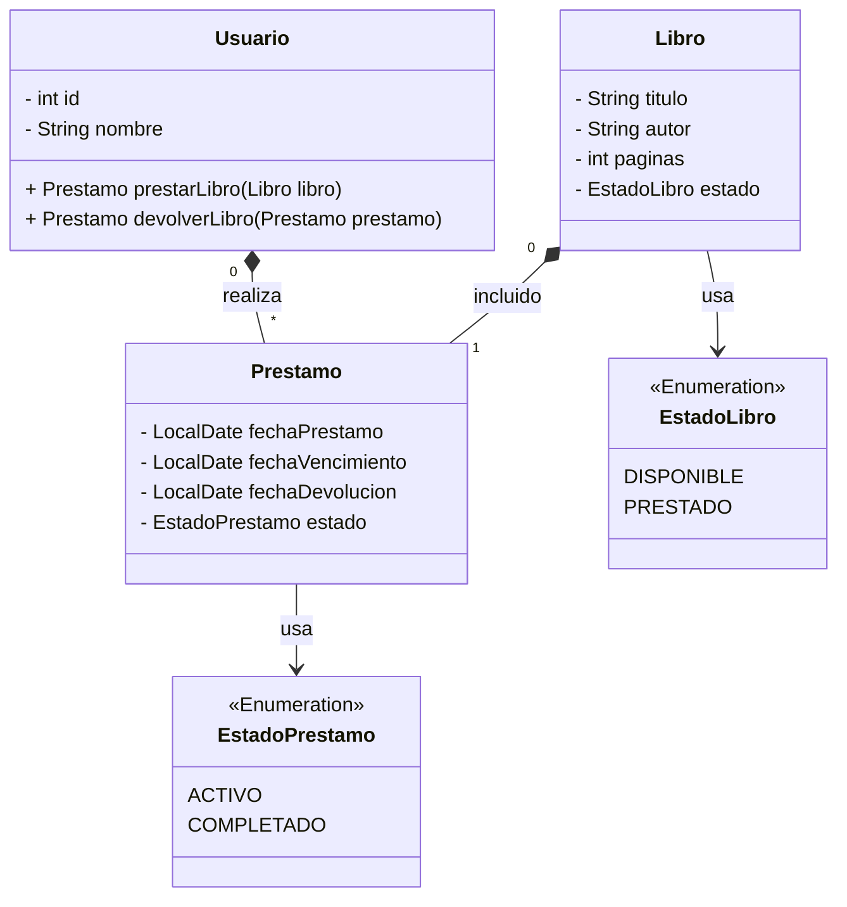

# Trabajo Práctico 1: Practica de UML

## Sistema de Biblioteca

Se desea modelar un sistema simplificado para una biblioteca. La biblioteca tiene libros que pueden ser prestados a los usuarios registrados. Cada usuario puede prestar varios libros, pero un libro solo puede estar en posesión de un usuario a la vez. Si el libro no está prestado, está disponible para el próximo usuario.

### 1. Diagrama

### 2. Relaciones

- **Usuario y Préstamo (Composición):** Un Usuario realiza de 0 a muchos Préstamos. Si el Usuario desaparece, sus Préstamos también desaparecen.
- **Libro y Préstamo (Composición):** Un Libro está incluido en de 0 a muchos Préstamos. Si el Libro desaparece, sus Préstamos también desaparecen.
