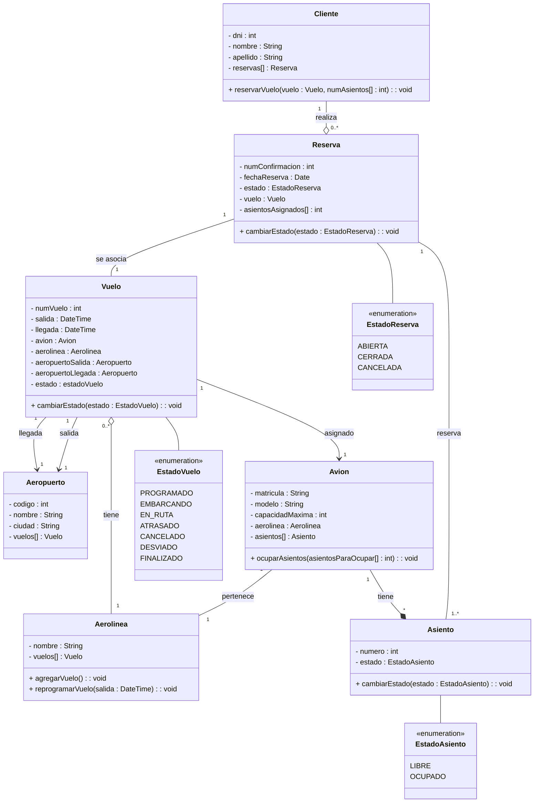

# TP1 - Practica de UML

## 3. Sistema de Reserva de Vuelos

Se desea modelar un sistema de reservas de vuelos. El sistema permite a los clientes buscar y reservar vuelos, que conectan aeropuertos específicos en determinadas fechas y horas.

**Requisitos:**

- Un vuelo tiene un número de vuelo, una aerolínea, una fecha y una hora de salida y llegada,
y está asociado a un avión.
- Los clientes pueden reservar asientos en los vuelos, y cada reserva tiene un número de
confirmación, la fecha de la reserva y el asiento asignado.
- Cada avión tiene un modelo, una capacidad máxima de pasajeros y pertenece a una
aerolínea.
- Los aeropuertos tienen un código único, un nombre y una ciudad.

### Diagrama de clases

#### Aclaración

Algunos atributos y/o métodos no eran pedidos expresos en la consigna, pero creí que era apropiado agregarlos.
